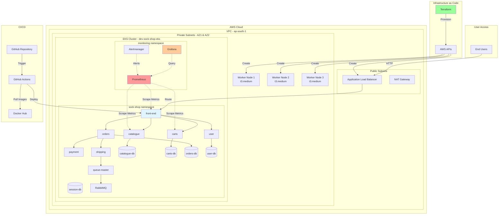

# System Architecture

## Key Components

### Infrastructure Layer
- **VPC**: Custom VPC with public and private subnets across 2 AZs
- **EKS Cluster**: Managed Kubernetes cluster (dev-sock-shop-eks)
- **Worker Nodes**: 3x t3.medium instances
- **Load Balancer**: AWS ELB for external access

### Application Layer (sock-shop namespace)
- **Frontend**: User-facing web application
- **Microservices**: catalogue, carts, orders, payment, shipping, user
- **Databases**: MongoDB and MySQL instances
- **Message Queue**: RabbitMQ for async processing

### Monitoring Layer (monitoring namespace)
- **Prometheus**: Metrics collection and storage
- **Grafana**: Visualization and dashboards
- **Alertmanager**: Alert routing and notifications

### CI/CD Pipeline
- **GitHub**: Source code repository
- **GitHub Actions**: Automated deployment pipeline
- **Docker Hub**: Container image registry

### Infrastructure as Code
- **Terraform**: Infrastructure provisioning and management
