# CI/CD Pipeline Architecture

```mermaid
flowchart LR
    subgraph "Developer"
        DEV[Developer]
    end
    
    subgraph "Version Control"
        GIT[GitHub Repository]
        BRANCH[Feature Branch]
        MAIN[Main Branch]
    end
    
    subgraph "GitHub Actions Workflow"
        TRIGGER{Trigger Event}
        
        subgraph "Validation Stage"
            VALIDATE[Validate YAML<br/>Manifests]
        end
        
        subgraph "Staging Deployment"
            CONF_AWS_S[Configure AWS<br/>Credentials]
            KUBECONFIG_S[Update<br/>kubeconfig]
            DEPLOY_S[kubectl apply<br/>complete-demo.yaml]
            ROLLOUT_S[Wait for<br/>Rollout Status]
            SMOKE_S[Smoke Tests]
        end
        
        subgraph "Production Deployment"
            CONF_AWS_P[Configure AWS<br/>Credentials]
            KUBECONFIG_P[Update<br/>kubeconfig]
            DEPLOY_P[kubectl apply<br/>complete-demo.yaml]
            ROLLOUT_P[Wait for<br/>Rollout Status]
            VERIFY_P[Verify<br/>Deployment]
        end
    end
    
    subgraph "AWS EKS"
        STAGING[Staging Environment<br/>sock-shop namespace]
        PROD[Production Environment<br/>sock-shop namespace]
    end
    
    subgraph "Monitoring"
        PROM[Prometheus]
        GRAF[Grafana]
        ALERT[Alertmanager]
    end
    
    DEV -->|1. Push Code| BRANCH
    BRANCH -->|2. Create PR| GIT
    GIT -->|3. Trigger| TRIGGER
    
    TRIGGER -->|PR Event| VALIDATE
    VALIDATE -->|Success| CONF_AWS_S
    CONF_AWS_S --> KUBECONFIG_S
    KUBECONFIG_S --> DEPLOY_S
    DEPLOY_S --> ROLLOUT_S
    ROLLOUT_S --> SMOKE_S
    SMOKE_S --> STAGING
    
    TRIGGER -->|Push to Main| VALIDATE
    VALIDATE -->|Success| CONF_AWS_P
    CONF_AWS_P --> KUBECONFIG_P
    KUBECONFIG_P --> DEPLOY_P
    DEPLOY_P --> ROLLOUT_P
    ROLLOUT_P --> VERIFY_P
    VERIFY_P --> PROD
    
    STAGING -.->|Metrics| PROM
    PROD -.->|Metrics| PROM
    PROM -.->|Visualize| GRAF
    PROM -.->|Trigger| ALERT
    
    style VALIDATE fill:#99ccff
    style DEPLOY_S fill:#99ff99
    style DEPLOY_P fill:#ff9999
    style STAGING fill:#e1f5ff
    style PROD fill:#ffe1e1
```


## Pipeline Stages

### 1. Code Push & PR Creation
- Developer pushes code to feature branch
- Creates Pull Request to main branch

### 2. Validation Stage (All Branches)
- Validates Kubernetes YAML manifests
- Checks syntax and structure
- Runs in ~5 seconds

### 3. Staging Deployment (Pull Requests)
- **Trigger**: On Pull Request creation/update
- **Steps**:
  1. Configure AWS credentials
  2. Update kubeconfig for EKS cluster
  3. Apply Kubernetes manifests
  4. Wait for rollout to complete (5min timeout)
  5. Run smoke tests
- **Duration**: ~1-2 minutes
- **Environment**: sock-shop namespace

### 4. Production Deployment (Main Branch)
- **Trigger**: On merge to main branch
- **Steps**:
  1. Configure AWS credentials
  2. Update kubeconfig for EKS cluster
  3. Apply Kubernetes manifests
  4. Wait for all deployments to stabilize
  5. Verify all pods are running
  6. Get application URL
- **Duration**: ~2-3 minutes
- **Environment**: sock-shop namespace

### 5. Continuous Monitoring
- Prometheus scrapes metrics from all pods
- Grafana displays real-time dashboards
- Alertmanager sends notifications on issues

## Deployment Flow
```
Feature Branch → PR → Staging Deployment → Code Review → Merge → Production Deployment
```

## Key Features
- ✅ Automated validation on every commit
- ✅ Staging environment for testing
- ✅ Production deployment on approval
- ✅ Rollback capability via Kubernetes
- ✅ Real-time monitoring integration
